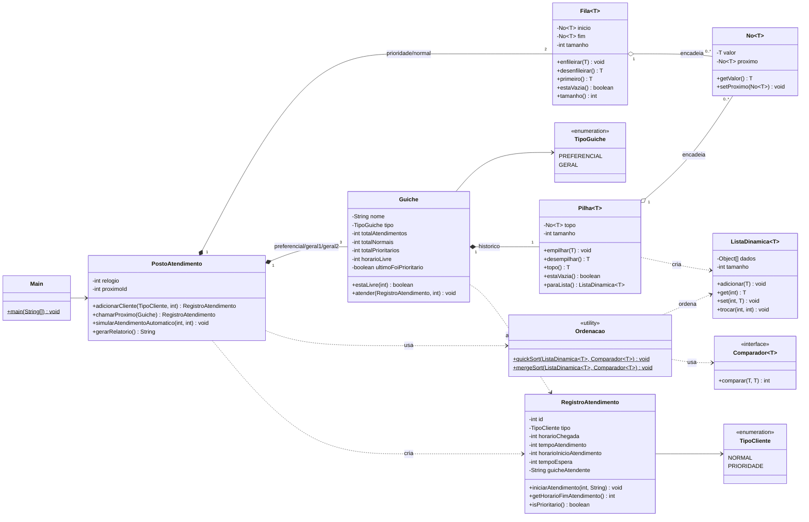

# Diagrama UML — Posto de Atendimento Bancário

Versão em **Mermaid** (renderiza direto no GitHub e no VS Code).
Há também a versão **PlantUML** em [`UML.puml`](UML.puml), que pode ser
renderizada em <https://www.plantuml.com/plantuml> ou pela extensão PlantUML do VS Code.

